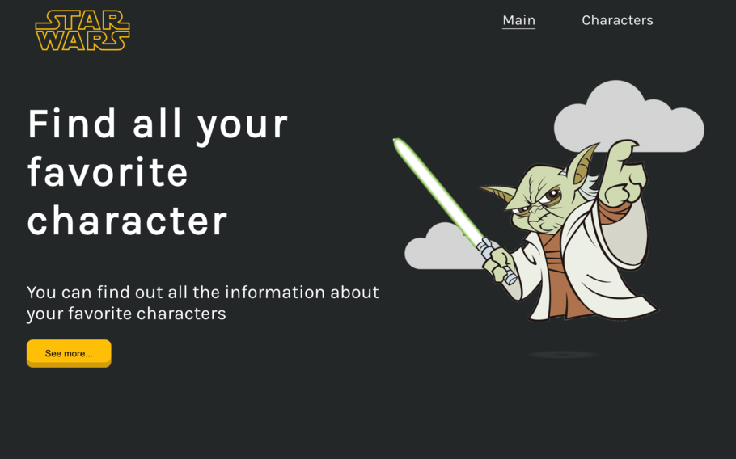
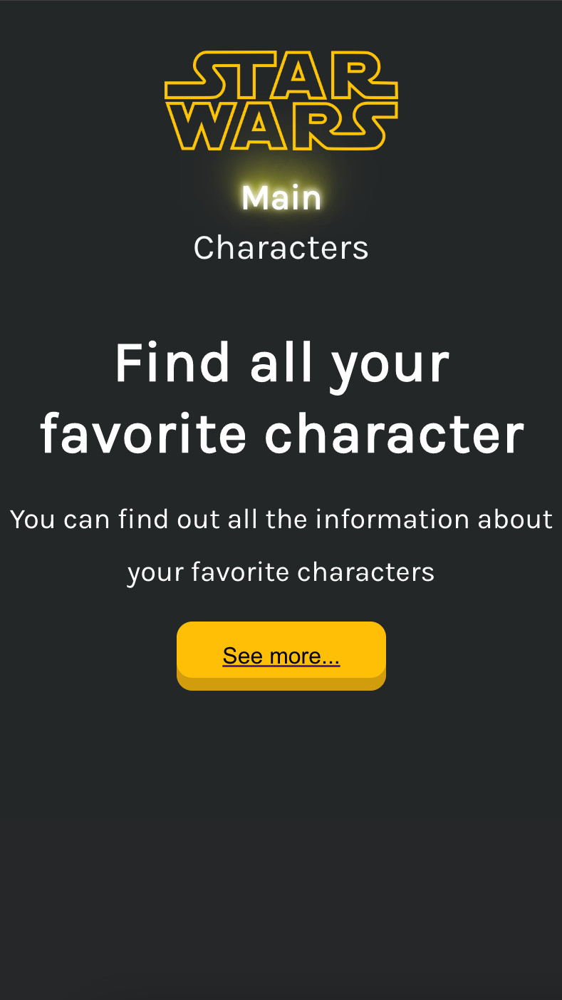
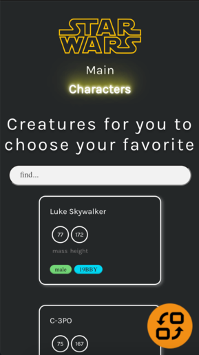
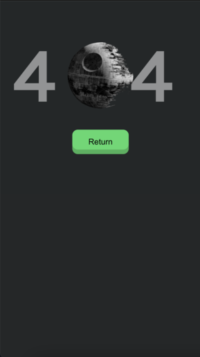
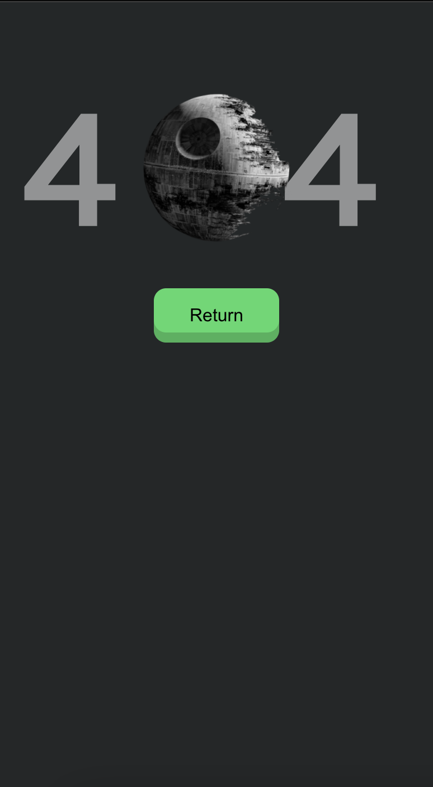
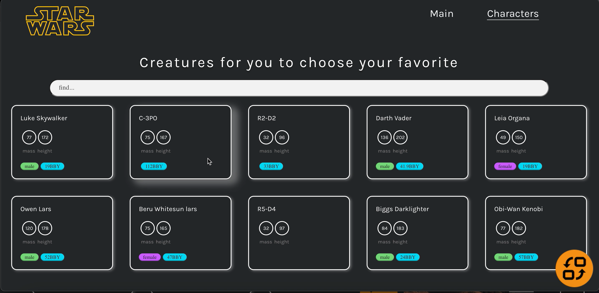
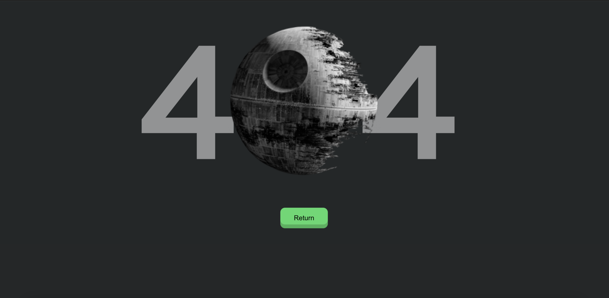
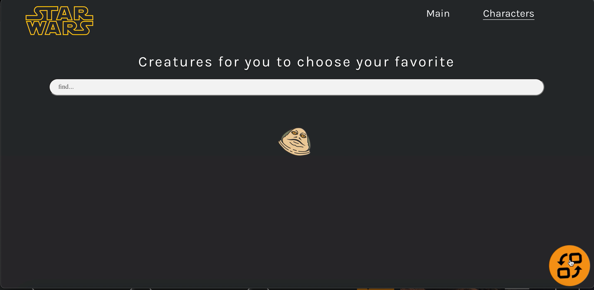

# Star Wars API React App

A React app built using data from the swapi.dev API with the help of: 

> Redux
> Saga
> Axios

Check out the app [HERE](https://star-wars-barsukova.vercel.app/)!

## Summary

I built this app to work with external API data.

Some screenshots to show how app displays on mobile devices:

And on laptop: 

